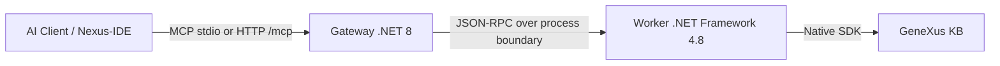

# GeneXus MCP Server — GeneXus 18 for Claude, Cursor, and AI Agents

[](https://www.npmjs.com/package/genexus-mcp)
[](https://www.npmjs.com/package/genexus-mcp)
[](https://lobehub.com/mcp/lennix1337-genexus18mcp)
[](https://opensource.org/licenses/MIT)

> **¿Hablás español?** → [Guía de inicio en español](docs/GETTING_STARTED.es.md)
> **Stuck?** → [Troubleshooting guide](TROUBLESHOOTING.md)

---

**GeneXus MCP Server** lets AI agents — Claude Desktop, Claude Code, Cursor, Antigravity, and any MCP-compatible client — read, edit, analyze, and refactor objects inside a GeneXus 18 Knowledge Base. It talks to the **native GeneXus SDK**, so the agent works with the *real* KB, not a copy or a parsed approximation.

In practice: you point the MCP at your KB, then ask your AI assistant things like *"list all transactions with attribute CustomerId"*, *"add a rule to the Order transaction that validates the total"*, or *"refactor this procedure to use the new SDT"* — and it does it.

---

## Prerequisites

Before you start, make sure you have:

- ✅ **Windows** (GeneXus is Windows-only — this MCP runs on Windows)
- ✅ **GeneXus 18** installed locally (usually `C:\Program Files (x86)\GeneXus\GeneXus18`)
- ✅ **A GeneXus 18 Knowledge Base** opened at least once in the IDE (so it has been built/initialized)
- ✅ **Node.js 18+** ([download](https://nodejs.org/))
- ✅ **An MCP-compatible AI client** — [Claude Desktop](https://claude.ai/download), [Claude Code](https://claude.com/claude-code), Cursor, Antigravity, etc.

You do **not** need to clone this repo or install anything globally — `npx` handles it.

---

## Quickstart (3 steps)

### Step 1 — Run the installer

Open a terminal and run, replacing the paths with **your** KB folder and **your** GeneXus install:

```bash
npx genexus-mcp@latest init --kb "C:\KBs\YourKB" --gx "C:\Program Files (x86)\GeneXus\GeneXus18"
```

> Prefer the wizard? Run `npx genexus-mcp@latest init --interactive` and answer the prompts.

When it finishes you should see `🎉 You are all set!` plus a JSON snippet for your AI client.

### Step 2 — Register the MCP in your AI client

The installer **auto-registers** the server with Claude Desktop, Claude Code, Cursor, and Antigravity when it detects them. If yours wasn't detected, copy the JSON snippet from Step 1 into your client's MCP config manually. See the [client setup guide](TROUBLESHOOTING.md#client-setup) if unsure where that file lives.

### Step 3 — Restart your AI client and test

Fully close and reopen Claude / Cursor / etc. Then try this prompt:

> *"Using the GeneXus MCP, list the first 5 transactions in my KB and show their names."*

If you get a list back — **you're done**. Skip to [What can I ask the AI?](#what-can-i-ask-the-ai) for ideas.

If something didn't work, go straight to [Troubleshooting](TROUBLESHOOTING.md) — most issues are covered there.

---

## 🤖 Let your AI install it for you

If you'd rather not run anything in the terminal yourself, paste this into your AI chat:

> Please configure the GeneXus MCP server. Run `npx genexus-mcp@latest init --kb "<MY_KB_PATH>" --gx "<MY_GENEXUS_PATH>"` in the terminal. If I haven't told you my GeneXus path and KB path yet, ask me first. Once it succeeds, read the JSON block it printed and add it to my MCP client config. Tell me when I should restart the client to start using GeneXus tools.

Replace the placeholders or let the AI ask you for them.

---

## What can I ask the AI?

Once installed, here's what unlocks. Try these as your first prompts:

**Exploration**
- *"List all objects of type Procedure in the KB."*
- *"Show me the source of the procedure CalculateInvoiceTotal."*
- *"Find all transactions that reference the attribute CustomerId."*

**Editing**
- *"Add a rule to the Order transaction: error('Total must be positive') if Total < 0."*
- *"Add a new attribute CreatedAt of type DateTime to the Customer transaction."*
- *"Rename the variable &qty to &quantity in procedure CreateOrder."*

**Analysis**
- *"Explain what the procedure ProcessShipment does, step by step."*
- *"What SQL does the query in WebPanel CustomerList generate?"*
- *"Summarize the structure of the Sales module."*

**Build & lifecycle**
- *"Build the KB and report any errors."*
- *"Run the unit tests and show me which failed."*

The agent picks the right tool from the **30+ tools** the MCP exposes (read, edit, refactor, analyze, build, layout automation, history, SQL preview, etc.). The full tool list is in [Tool Surface](#tool-surface) below.

---

## Supported AI clients

Auto-detected and auto-configured by the installer:

| Client | Auto-config | Notes |
|---|---|---|
| Claude Desktop | ✅ | Restart required after install |
| Claude Code (CLI) | ✅ | Reload session |
| Cursor | ✅ | Restart required |
| Antigravity | ✅ | Restart required |
| Any MCP client | Manual | Use the JSON snippet printed by `init` |

---

## Troubleshooting

Most install issues fall into a handful of buckets — see **[TROUBLESHOOTING.md](TROUBLESHOOTING.md)** for fixes:

- Installer can't find GeneXus or the KB
- AI client doesn't see the GeneXus tools after restart
- "Worker failed to start" / .NET 4.8 errors
- KB build errors / locked artifacts
- Port 5000 already in use
- Permissions on `%LOCALAPPDATA%\GenexusMCP\`

Still stuck? [Open an issue](https://github.com/lennix1337/Genexus18MCP/issues) with the output of `npx genexus-mcp doctor --mcp-smoke`.

---

## Tool Surface

The worker exposes these tool families to the MCP router. *(Detailed schemas in [`GEMINI.md`](GEMINI.md).)*

- **Search & Discovery** — `genexus_query`, `genexus_read`, `genexus_inspect`, `genexus_list_objects`, `genexus_properties`
- **Editing & Architecture** — `genexus_edit`, `genexus_create_object`, `genexus_refactor`, `genexus_forge`, `genexus_add_variable`
- **Analysis** — `genexus_analyze`, `genexus_inject_context`, `genexus_doc`, `genexus_explain_code`, `genexus_summarize`
- **File System & Assets** — `genexus_asset`, `genexus_export_object`, `genexus_import_object`
- **History & DB** — `genexus_history`, `genexus_get_sql`, `genexus_structure`
- **Lifecycle & Build** — `genexus_lifecycle`, `genexus_test`, `genexus_format`
- **Native Layout SDK** — `genexus_layout` (`get_tree`, `find_controls`, `set_property`, `rename_printblock`, `add_printblock`, `get_preview`, …)
- **Patterns** — Smart XML generation/interpretation (e.g., WorkWithPlus PatternInstance).

**Edit modes** (`genexus_edit`): `xml` (full replacement, default), `ops` (typed semantic ops like `set_attribute`, `add_rule`), `patch` (JSON-Patch RFC 6902).

**Safe by default**: all write tools accept `dryRun: true` (returns a preview without mutating the KB) and `idempotencyKey` (safe retries; concurrent calls coalesce, results cached 15 min).

---

## AXI CLI (for agents and automation)

The `genexus-mcp` command itself is also an agent-facing CLI with token-optimized output:

```bash
genexus-mcp status               # gateway/worker state
genexus-mcp doctor --mcp-smoke   # health check + protocol probe
genexus-mcp tools list           # list available tools
genexus-mcp config show          # current resolved config
genexus-mcp layout status        # native layout automation state
```

Global flags: `--format toon|json|text` · `--fields f1,f2,...` · `--limit N` · `--query <text>` · `--quiet` · `--no-color`.

Full contract: [`docs/axi_cli_contract.md`](docs/axi_cli_contract.md). Best-practices playbook: [`docs/llm_cli_mcp_playbook.md`](docs/llm_cli_mcp_playbook.md).

---

## Advanced Configuration

The installer writes a `config.json` for you. To customize networking, timeouts, or shadow paths:

```json
{
  "Server": {
    "HttpPort": 5000,
    "BindAddress": "127.0.0.1",
    "SessionIdleTimeoutMinutes": 10,
    "WorkerIdleTimeoutMinutes": 5
  },
  "GeneXus": {
    "InstallationPath": "C:\\Program Files (x86)\\GeneXus\\GeneXus18",
    "WorkerExecutable": "worker\\GxMcp.Worker.exe"
  },
  "Environment": {
    "KBPath": "C:\\KBs\\YourKB"
  }
}
```

### Architecture



- **Lazy worker**: the heavy .NET 4.8 worker only spins up on first command and shuts down after `WorkerIdleTimeoutMinutes` of inactivity to unlock build artifacts.
- **Gateway reuse**: multiple IDE instances share one gateway via lease files at `%LOCALAPPDATA%\GenexusMCP\gateway-leases`.
- **HTTP mode**: also available at `http://127.0.0.1:5000/mcp` with SSE. Header: `MCP-Protocol-Version: 2025-11-25`.

---

## Development & building from source

Want to contribute or run a local dev build?

1. Clone this repo on Windows.
2. Run `.\setup.bat` — checks prerequisites, builds the C# components, and auto-registers the local build with detected AI clients.
3. If GeneXus or your KB aren't auto-detected, follow the prompts.

### Nexus-IDE (VS Code extension)

`src/nexus-ide` is a lightweight VS Code extension that ships with the repo:
- Virtual filesystem using the `genexus://` scheme
- Dynamic KB explorer with multi-part editing (Source, Rules, Events, Variables)
- Built-in MCP discovery commands (tools, resources, prompts)

### Automated release

- Workflow: `.github/workflows/release.yml`
- Trigger: push to `main` with a `package.json` version bump
- Behavior: publishes to npm if version is new + creates a GitHub Release tagged `v<version>`
- Required secret: `NPM_TOKEN`

---

## License

MIT — see [LICENSE](LICENSE).

> **Search keywords:** GeneXus MCP · GeneXus 18 MCP · GeneXus AI · GeneXus Claude · Model Context Protocol GeneXus · GeneXus low-code AI agent · GeneXus Cursor · GeneXus Antigravity
